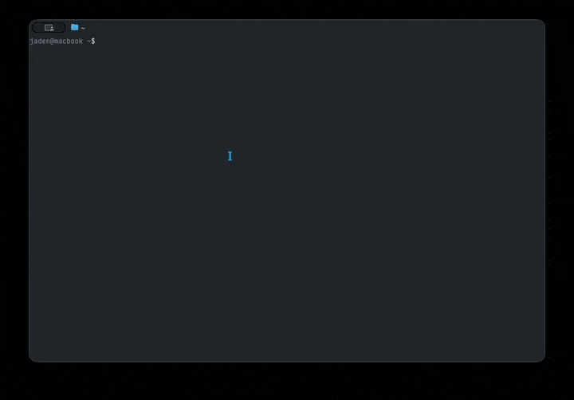

<p align="center">
  
</p>

<h1 align="center">notebook</h1>

<p align="center">
  <strong>A terminal-native note editor with a block-based editing experience.</strong>
</p>

<p align="center">
  <a href="https://github.com/oobagi/notebook-cli/releases/latest"></a>
  
  
  
</p>

<p align="center">
  <a href="#install"><strong>Install</strong></a>
  ·
  <a href="#quick-start"><strong>Quick Start</strong></a>
  ·
  <a href="#features"><strong>Features</strong></a>
  ·
  <a href="#cli-reference"><strong>CLI Reference</strong></a>
  ·
  <a href="#configuration"><strong>Configuration</strong></a>
  ·
  <a href="ROADMAP.md"><strong>Roadmap</strong></a>
</p>

---

<p align="center">
  
  <br>
  <sub><i>Recorded on v1.0.0</i></sub>
</p>

Notebook is a TUI note manager that organizes markdown notes into notebooks. It comes with a block editor supporting 15 block types, an interactive browser with search, 16 themes, inline markdown formatting, undo/redo, and a view mode for reading.

Everything runs in your terminal. No account, no sync, no config required.

## Install

```bash
# Homebrew
brew install oobagi/tap/notebook

# Go (1.25+)
go install github.com/oobagi/notebook-cli/cmd/notebook@latest

```

Alternatively, prebuilt binaries for macOS and Linux are available on the [releases page](https://github.com/oobagi/notebook-cli/releases/latest).

## Quick Start

```bash
# Launch the interactive browser
notebook

# Create a note (auto-creates the notebook if it doesn't exist)
notebook ideas new "First Thought"

# Open it in the editor
notebook ideas "First Thought"

# Open any .md or .txt file directly
notebook path/to/file.md
```

## Features

- **Block editor** — 15 block types: paragraphs, headings (3 levels), bullet lists, numbered lists, checklists, code blocks, tables, quotes, definitions, callouts, dividers, embeds, and kanban boards. Press **/** to switch types.
- **Tables** — Pipe-delimited GFM tables with per-column widths. Alt+R/C to add rows/columns, Alt+Shift+Backspace/Alt+Shift+D to delete. Press Enter on an empty row to exit the table and drop the row.
- **Kanban boards** — Visual boards with priority cards. Arrows navigate, Shift+arrows move cards, **n** new card, **Opt+K** copy card, **p** cycle priority, **s** toggle auto-sort. Round-trips as a `kanban` fenced block.
- **Callouts** — Five admonition variants (Note, Tip, Important, Warning, Caution). Ctrl+T to cycle.
- **Definitions** — Term/definition pairs. Press **:** to search and jump to definitions.
- **Embeds** — Reference other notes inline with `![[notebook/note]]`. Click in view mode to expand.
- **Nested lists** — Tab/Shift+Tab to indent and outdent. Checklist cascading on toggle.
- **Syntax highlighting** — 500+ languages via Chroma. Name the language on the first line of a code block.
- **Inline formatting** — `**bold**`, `*italic*`, `~~strikethrough~~`, `__underline__` render live in inactive blocks.
- **View mode** — Ctrl+R for a clean, read-only view. Click checklists to toggle them without editing.
- **Search** — Press **/** in the browser to search across all notebooks by title.
- **Preview pane** — Press **p** to see note content while browsing.
- **Settings** — Press **,** in the browser to configure storage, theme, date format, and more.
- **16 themes** — Dark, Ocean, Forest, Sunset, Monochrome, Rose, Cyberpunk, Minimal, Retro, Nord, Solarized, Dracula, Tokyo, Lavender, Ember, Catppuccin.
- **Undo/redo** — 100 levels, tracks content changes only.
- **Mouse support** — Click checklists in view mode, native text selection in the editor.
- **Open external files** — Press **i** in the browser or pass a file path to open any .md or .txt file.

<details>
<summary><strong>Editor keybindings</strong></summary>

| Key | Action |
|---|---|
| **Enter** | New block below |
| **/** | Command palette (at start of block) |
| **:** | Definition lookup (on empty block) |
| **Ctrl+S** | Save |
| **Ctrl+Z / Ctrl+Y** | Undo / Redo |
| **Ctrl+K** | Cut block |
| **Alt+Up / Alt+Down** | Move block up/down |
| **Tab / Shift+Tab** | Indent / outdent list |
| **Ctrl+X** | Toggle checkbox |
| **Ctrl+T** | Cycle callout variant |
| **Ctrl+H** | Sort checked items to bottom |
| **Ctrl+R** | View mode |
| **Ctrl+J / Shift+Enter** | Newline within block |
| **Ctrl+W** | Toggle word wrap |
| **Ctrl+G** | Help |
| **Esc** | Back to browser |

</details>

<details>
<summary><strong>Browser keybindings</strong></summary>

| Key | Action |
|---|---|
| **Up/Down** | Navigate |
| **Enter** | Open |
| **Esc** | Back / Quit |
| **/** | Search |
| **n** | New notebook/note |
| **d** | Delete |
| **r** | Rename |
| **c** | Copy to clipboard |
| **i** | Open external file |
| **p** | Preview pane |
| **t** | Theme picker |
| **,** | Settings |
| **Tab** | Cycle sections |
| **?** | Help |

</details>

## CLI Reference

```
notebook                               Launch interactive browser
notebook list                          List all notebooks
notebook <book> list                   List notes in a notebook
notebook <book> new "Title"            Create a note
notebook <book> "Title"                Open a note in the editor
notebook <book> "Title" edit           Open a note in the editor
notebook <book> "Title" copy           Copy note to clipboard
notebook <book> "Title" delete         Delete a note
notebook <book> delete                 Delete a notebook
notebook search "query"                Search across all notebooks
notebook <book> search "query"         Search within a notebook
notebook path/to/file.md               Open any .md or .txt file
notebook theme [name]                  List or set theme
notebook config                        Show current config
notebook config set <key> <value>      Set a config value
```

## Configuration

Config lives at `~/.config/notebook/config.toml`. Set values with `notebook config set`:

| Key | Default | Description |
|---|---|---|
| `storage_dir` | `~/.notebook` | Where notebooks are stored |
| `editor` | built-in | External editor command (leave empty for built-in) |
| `theme` | `dark` | Theme name (see `notebook theme` for options) |
| `date_format` | `relative` | How dates are displayed |
| `hide_checked` | `false` | Sort checked items to bottom of lists |
| `cascade_checks` | `true` | Toggle parent/child checklists together |
| `show_preview` | `true` | Show preview pane in browser |
| `word_wrap` | `true` | Wrap long lines in the editor |

## License

MIT
